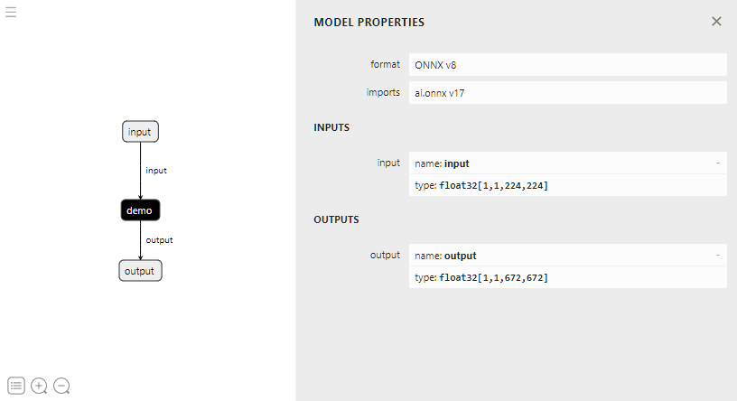

# Tutorial
## Environment setup: Docker
This tutorial is designed to be run from inside a docker container generated from Dockerfile in
the root directory. You will need to have docker installed and running. The container can be built and run via
```
docker build -t tvm2onnx -f Dockerfile .
docker run -ti tvm2onnx
```

Note that the build process could take around 30 minutes for the first-time user.

## Environment setup: VSCode
This repository is designed to work well with vscode and its [Dev Containers extension](https://marketplace.visualstudio.com/items?itemName=ms-vscode-remote.remote-containers) and this is how the project has been developed. If you are using vscode and don't have
an Nvidia GPU then comment out line 11 in .devcontainer.json
```
        "--gpus", "all",
```
## GPU access
If you do not have access to the GPU, when running the tvm2onnx container you will see a warning about Nvidia drivers not being detected. This warning does not prevent you from continuing with the following steps.

## Introduction
In this tutorial we will walk through the end-to-end process of
* Converting an ONNX model to TVM
* Optimizing the TVM model
* Packaging the TVM model in ONNX
* Running the new ONNX model in onnxruntime

tvm2onnx is designed to run on Linux.

## Building TVM

TVM models depend on a tvm_runtime library for execution and the version of TVM used to generate
the TVM model and the version of the tvm_runtime must match exactly. In order to ensure these
versions match, tvm2onnx statically links tvm_runtime to the packaged model. When you tune a model against TVM version X you must pass the tvm_runtime library for the same TVM version X to tvm2onnx.

By default when building TVM, tvm_runtime is built with dynamic linkage. For this tutorial we will
build TVM and specify that tvm_runtime is built for static linkage. Because tvm_runtime is statically linked to the model any version of TVM can be used. tvm2onnx is not tied to a particular version of TVM.

This tutorial uses a build of TVM that is included in the Docker container. If you want to use tvm2onnx with a different version of TVM or you want to use it outside the container then use this build example. The important flag is BUILD_STATIC_RUNTIME=ON which will build the libtvm_runtime.a archive file.
```bash
mkdir ~/tvm2onnx_tutorial
cd ~/tvm2onnx_tutorial
git clone --recursive https://github.com/apache/tvm.git
cd tvm
mkdir build
cp cmake/config.cmake .
echo "set(BUILD_STATIC_RUNTIME ON)" >> config.cmake
echo "set(USE_FALLBACK_STL_MAP ON)" >> config.cmake
cd build
cmake ..
make -j 8
```

When done, the build will produce both *libtvm.so* and *libtvm_runtime.a* in the build directory.

## Tuning Your TVM Model
This tutorial does not go into any detail on how to tune a TVM model. Since this is a complex topic please refer to the [TVM Documentation](https://tvm.apache.org/docs/install/index.html) and the [TVM github repository](https://github.com/apache/tvm) for tutorials, code samples, and assistance.

This tutorial does contain a small [sample model](super-resolution.onnx) and [python script](basic_tune_model.py) that can be used to do quick but very basic tuning tuning of a model. To run the tuning script type
```bash
python tutorial/basic_tune_model.py --model tutorial/super-resolution.onnx --output opt_model --axis-size batch_size=1
```
The resulting files are used in the next section to package the TVM-tuned model in ONNX.

## Convert Your TVM Model to ONNX
If you ran the python command in the previous section you can now package the tuned model in ONNX by

```bash
python scripts/onnx_package.py --model opt_model/model.o --ro opt_model/vm_exec_code.ro --constants opt_model/constants.pkl --metadata opt_model/metadata.json --tvm-runtime 3rdparty/tvm/build/libtvm_runtime.a --output demo.onnx.tar
```
The tar file contains the following files. The const files may be named differently.
* const_10, const_14, const_20, const_4 - External constants to allow support for large models.
* custom_demo.so - The onnxruntime custom-op shared library contain the TVM-tuned model.
* demo.onnx - The onnx model which is a single node that uses the custom op in custom_demo.so

You can examine demo.onnx in [netron.app](https://netron.app/) and it should look like this.
The entire TVM-compiled model is contained in the node *demo* which is implemented as an onnxruntime custom operator.

||
|:--:|
|*A view of demo.onnx in netron.app*|

## Run Your New ONNX Model with onnxruntime
After converting the model to .onnx format you should have a demo.onnx.tar file. You can run this model in onnxruntime by using the following
```
python tutorial/run_inference.py --model demo.onnx.tar
```

Instead of running the model with run_inference.py you can use the following python code. The function *register_custom_ops_library* registers the model's custom op library with onnxruntime. In the demo.onnx.tar file the custom op library registered would be *custom_demo.so*. You will need to untar demo.onnx.tar to use this example
```python
sess_options = onnxruntime.SessionOptions()
sess_options.register_custom_ops_library(<path to custom op>)
engine = onnxruntime.InferenceSession(
    onnx_path,
    providers=["CPUExecutionProvider"],
    provider_options=[{}],
    sess_options=sess_options,
)
```
